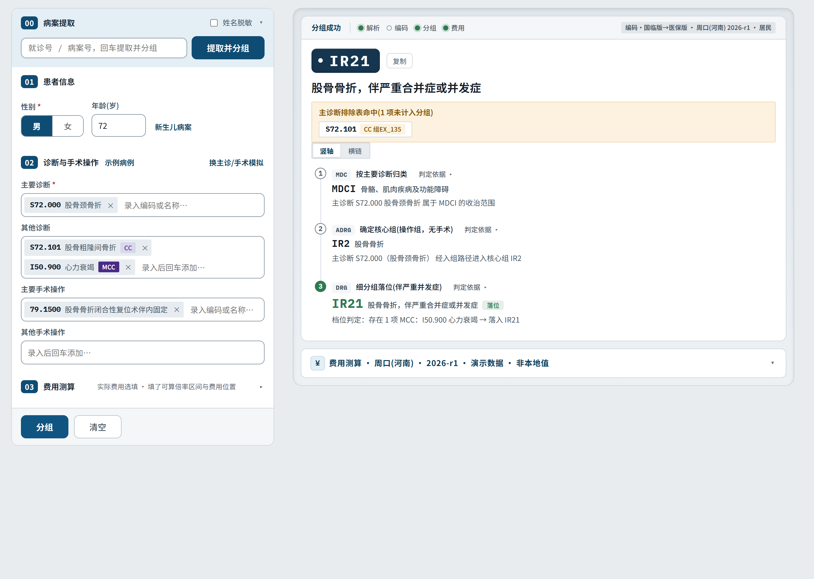
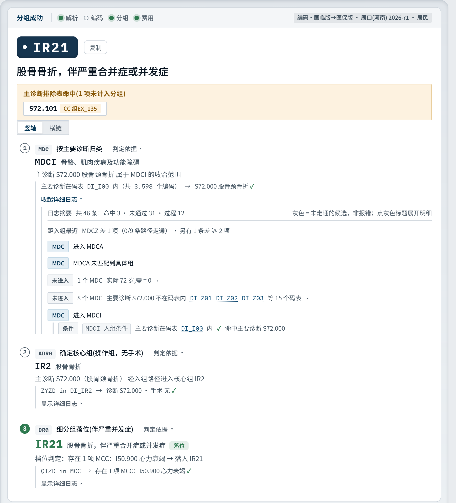
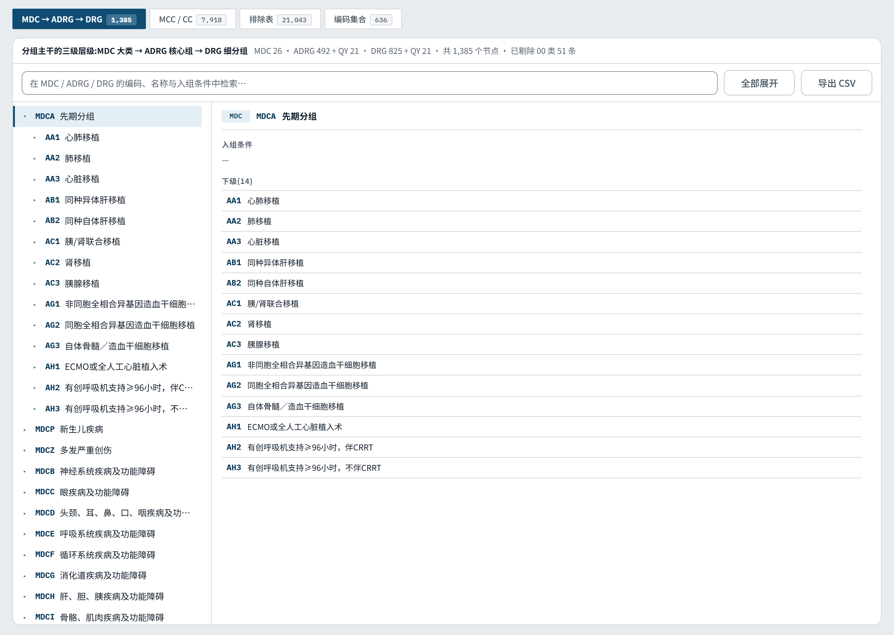
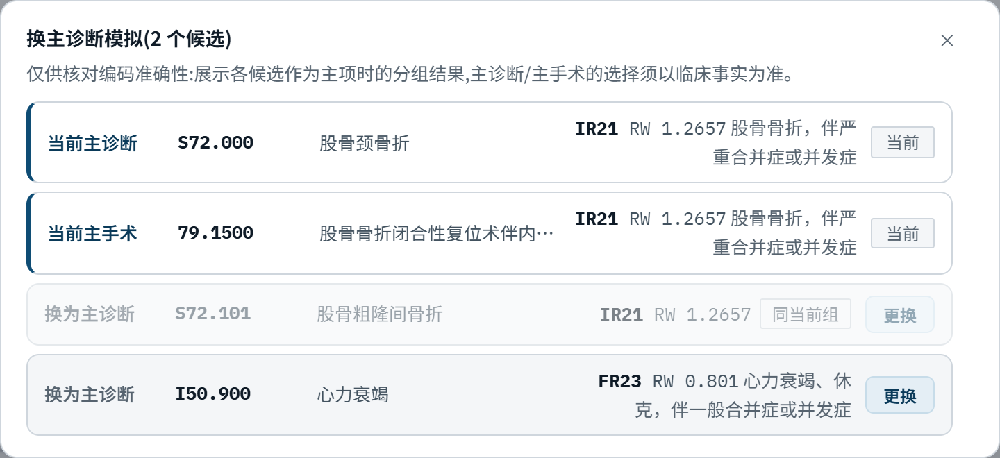

# DRGX — CHS-DRG 3.0 分组工作台

**把国家医保局公开的 DRG 3.0 分组配置信息，做成能装进医院内网、每一次判定都追得到规则原文的系统。**

面向病案与医保编码人员的 Web 服务：单病例分组（含判定轨迹）、批量分组（文件导入 / 从 HIS 提取病案）、
地区支付测算。免安装，解压双击即用；默认只给本机用，要全院使用见第 2 节。



| | |
|---|---|
| 程序版本 | 1.0.0 |
| 分组方案 | CHS-DRG 3.0（2026-09-09 版配置信息） |
| 规则来源 | 国家医保局 2026-09-09 公开的《按病组（DRG）付费3.0版分组方案配置信息（更新）》（[官方公开页](https://www.nhsa.gov.cn/art/2026/9/9/art_14_22070.html)） |
| 界面 | 默认 http://localhost:8080/ |
| 安装 | 免安装，解压即用（standalone 形态不需要任何前置） |
| 访问范围 | 默认**仅本机**（监听 `127.0.0.1`）；全院使用见第 2 节 |
| 授权 | 程序本体 Apache-2.0 |
| 反馈 | 仓库 Issues 或 41347620@qq.com（详见文末「反馈与联系」） |

## 为什么做这个

2026-09-09，国家医保局公开了按病组（DRG）付费 3.0 版的分组配置信息。用官方的话说，这是推动分组工作
**从「结果可查」迈向「规则可溯」**。

官方公开的是规则本身；而公开出来的载体，是一份 Excel 配置表 —— 它不能分组、不能追路径、接不上 HIS、
也不能直接给科室用。DRGX 补的是这一段：把那份配置表变成一屏能用的系统，并且把"为什么这一例进了这个组"
留成可以逐条核对的证据 —— 既给规则原文，也给本例事实。

## 三个特点

**1. 判定可溯 —— 每一次分组都留下证据**

- 判定依据分三层展开：① MDC 按主要诊断归类 → ② ADRG 确定核心组 → ③ DRG 细分组落位；
  每一层都把「条件内容」与「命中事实」摆在同一条上。
- 详细日志逐条记下命中与未命中（含"未进入 N 个 MDC"及其理由），规则有争议时照这条路径核对，不用猜。
- 排除表命中的项单独标出（"主诊断排除表命中，1 项未计入分组"），不会悄悄吃掉。



**2. 跟随官方版本 —— 换一个文件就升级**

- 数据源就是官方工作簿原件（`data\packs\chs-drg-3.0\official\official-workbook.xlsx`），程序直接解析这份
  文件，中途不做格式转换。官方更新了，换这一个文件即可，不用改配置、不用重装 ——
  新表从官方公开页下载：<https://www.nhsa.gov.cn/art/2026/9/9/art_14_22070.html>
  （内网打不开官网属正常，在能上外网的机器上下载后拷进来即可）。
- 地区费用包按 `data\regions\<地区>\<版本>\` 组织，放进去自动生效（程序约 30 秒内发现），无需重启。
- 换一个地区只影响费用测算，分组结果不受影响。



**3. 数据不出院 —— 病例与解释权都留在院内**

- 解压、双击，浏览器打开就能用；科室使用**不需要装任何客户端**。不装数据库，不连外网。
- 运行时不请求任何外部 CDN，内网离线环境可用。
- 默认只监听 `127.0.0.1` —— 本服务没有账号体系，这是对患者数据的兜底（放开监听前先看第 2 节）。
- 代码 Apache-2.0，可自主修改与二次开发。

## 能力一览

| 能力 | 说明 |
|---|---|
| 单病例分组 | 录入性别 / 年龄 / 主要诊断 / 其他诊断 / 手术操作 → DRG 落位，附判定依据与详细日志 |
| 诊断联想录入 | 输入片段即出候选码，按字典匹配，不必背码表 |
| CC / MCC 徽章 | 其他诊断自动标出严重并发症（MCC）与合并症（CC），并给出严重程度对比 |
| 排除表命中 | 同一排除组内的互斥诊断只计一次，命中项在结果区常显 |
| 换主诊断模拟 | 把任意其他诊断提为主诊试算，并列展示两组结果；只陈列结果、不做高值排序暗示，也不动真实病案 |
| 批量分组 | 上传 HQMS 病案首页 CSV / XLSX，单文件 **128 MB / 100,000 行**；单行失败只记该行、不影响整单；跑完出结果表并可导出 CSV |
| 从 HIS 提取病案 | 按就诊号提取单例，或按出院日期区间批量提取（需启用 HIS 连接器，见第 3 节） |
| 编码版本 | 可在「国临版」（输入按国临目录受理，分组前自动转医保版）与「医保版」（输入即分组口径）之间切换 |
| 费用测算 | 按地区算法算标准支付 / 倍率 / 盈亏，并给出参数溯源 |
| 数据一览 | 官方工作簿原样回放，逐张逐行对照；编码集合成员 10 万余条，翻到哪页加载哪页 |
| 插件化 | 地区费用算法与 HIS 连接器各自独立，装哪个用哪个；单个插件出问题不影响系统启动 |
| 深浅主题 | 跟随系统色彩方案，或手动切换 |



## 数据规模

| 项 | 官方公布 | 本系统 |
|---|---|---|
| MDC 主要诊断大类 | 26 | 27 |
| ADRG 核心分组 | 492 | 538 |
| DRG 细分组 | 825 | 871 |
| 基层病组（第一批） | 31 | 31 |
| 并发症 / 合并症清单（MCC / CC） | 1,581 / 6,337 | 7,918 |
| 排除表（诊断互斥） | 21,036 条 | 21,043 条 |
| 编码集合成员 | 106,950 条 | 106,837 条 |
| 诊断字典 / 手术操作字典 | — | 37,722 / 14,330 |

分组三项比官方公布的多，是因为官方分组表里除了正式分组，还带着两类**没有名称**的档位；本系统把它们
一并装入、一并展示，**没有自行增补任何组**：

- **兜底档**（`0000` / `X00` / `X000`，共 51 个）：前面的分组规则全都没命中时，病例会落到这里。
  它是落位桶而不是正常分组结果 —— 出现它说明该例的编码信息不足以落组，应当回头核对编码。
- **歧义组**（`XQY`，21 个）：主要手术在有效操作范围内、但信息不足以细分到具体组时落在这里，
  同样是"编码待补全"的提示。

另外两处与官方数据的差异都出在数据本身：排除表官方工作簿漏登 7 条（已按官方正式版分组方案补齐）；
编码集合成员官方数里同一集合内重复登记了 113 条（多在手术操作集合），本系统已去重。
两组都以官方正式版为准，逐行可在「数据一览」页对照。

> **对外说明请用官方口径：26 个 MDC、492 个 ADRG、825 个 DRG 细分组。**
> 「数据一览」的层级树不展示兜底档，那里显示的组数会比上表小一些，属正常。

## 数据与结论的边界

- 本项目为**独立实现**，非国家医疗保障局官方产品，未获其认可或背书。
- 分组结果**仅供技术参考**，不作为医保结算、审核或任何行政决定的依据。
- 随包分发的地区费用包**全部是演示数据**：地区名称与权重都不是当地公布值，界面上也标着
  「演示数据 · 非本地值」；任何真实结算、审核、对账都不得使用。详见第 4 节。
- DRGX 不改变、也不解释规则：只按规则算，并把过程摊开。规则本身以官方发布文件为准。

## 快速开始

1. 把发布包**解压到任意目录**（例如 `D:\DRGX`）。
2. 双击目录里的 **`DRGX.exe`**。会弹出一个 `DRGX` 控制台窗口，滚到最后看到「服务已启动」就是起好了。
3. 打开浏览器访问 **http://localhost:8080/**。

**停服务 = 关掉那个控制台窗口。**

默认只监听本机，所以第 3 步只在这台电脑上打得开 —— 要让科室的电脑也能用，见第 2 节。

> 拿到的是**源码**而不是发布包？本仓库不含编译产物，见第 10 节。

## 1. 启动（默认：只给本机用）

| 方式 | 做法 | 说明 |
|---|---|---|
| 推荐 | 双击 `DRGX.exe` | 起服务；自己打开 http://localhost:8080/ |
| 备选 | 双击 `scripts\start-web.bat` | 向 `DRGX.exe` 问当前生效端口 → 先查端口是否被占 → 起服务 → 端口通了自动打开浏览器 |
| 命令行 | `DRGX.exe --port 9000` | 参数见下表 |

- 默认只监听 `127.0.0.1`，**只有本机能访问**。别的电脑打不开是设计如此，不是故障。
- 直接双击 `DRGX.exe` 时，控制台窗口就是服务本体，关掉后页面立刻打不开，属正常。

### 常用参数

| 参数 | 作用 |
|---|---|
| `--port <端口>` | 换端口（一次性；常规做法见下） |
| `--listen <地址>` | 监听地址，默认 `127.0.0.1`（全院使用见第 2 节） |
| `--pack <目录>` | 换数据包目录 |
| `--regions-root <目录>` | 换地区费用包根目录 |
| `--his <json>` | 指定 HIS 连接配置（见第 3 节） |
| `--plugins-root <目录>` | 指定插件目录 |
| `--no-plugins` | 不加载插件：费用算法与 HIS 提取病案都不可用，分组不受影响 |
| `--print-config` | 打印当前生效的配置后退出（排障第一步） |

改端口的常规做法是改 `appsettings.json` 里的 `Drgx:Port` 一处 —— 启动器与直启都读它，不必两处维护。
优先级：**命令行 > 环境变量（`Drgx__Port`）> `appsettings.json` > 内置默认**。

## 2. 全院使用（局域网部署）

把服务放在**一台常开的机器**上（建议信息科的服务器或运维机），其他科室用浏览器访问：

1. **放开监听**：改 `appsettings.json` 里的 `"Drgx": { "Listen": "0.0.0.0" }`，
   或启动时加 `--listen 0.0.0.0`。默认的 `127.0.0.1` 只有本机能连。
2. **放行端口**（管理员身份执行）。`remoteip` 填**本院网段**、把访问限制在内网（填错会连不上，
   不需要限制就整段删掉）：

   ```bat
   netsh advfirewall firewall add rule name="DRGX 8080" dir=in action=allow protocol=TCP localport=8080 remoteip=192.168.0.0/16
   ```

3. **科室访问**：浏览器打开 `http://<服务器IP>:8080/`。客户端**不装任何东西**，
   只要机器上有浏览器就行。
4. **让服务一直跑着**：服务随启动窗口关闭而停止，所以窗口要留着（可以最小化）；
   要开机自动起，用 Windows 的「任务计划程序」建一个"登录时启动 `DRGX.exe`"的任务即可。

### ⚠ 放开监听之前必须知道

本服务**没有账号体系**，且 `/api/his/*` 会返回**患者姓名、病案号、费用与诊断**。
（界面上的「姓名脱敏」只是替换页面显示文本，**接口响应里仍是真实姓名** —— 那是演示与截图用的开关，
不是安全措施。）

所以：

- **只在院内网使用**。防火墙规则按上面的写法收窄到院内网段，不要暴露到业务网或互联网。
- 建议**前置一台带认证的反向代理**（IIS / Nginx 等，接院内统一身份），科室访问代理地址，
  由代理挡住未认证的访问。
- 医院信息科通常另有审计与等保要求，接入前按院内规定评估。

## 3. 从 HIS 提取病案（默认不启用）

从 HIS 提取病案是可选项，**默认关闭**。启用只需把连接配置放到约定位置：

```
configs\his\healthone-1.local.json
```

放好即自动生效（`Drgx:HisConfig` 留空时程序会到 `configs\his\` 找 `*.local.json`），不用改任何配置、
不用重新打包，重启服务即可。

- 模板：`configs\his\healthone-1.sample.json` —— **照抄它不会生效**（文件名必须以 `.local.json` 结尾），
  且里面的连接串是**占位符**（`<HIS_HOST>` 等），照抄也连不上。
- 主要字段：`connector`（连接器 id，HealthOne / SQL Server 用 `sqlserver-healthone`）、`id`、
  `connectionString`、`commandTimeoutSeconds`、`sql.{record,diagnoses,operations,list}`（四条 SQL 模板，
  可逐条按本院库表覆盖）。
- 真实连接串**不要**写进 `appsettings.json`（它随包分发）；放 `*.local.json` 或环境变量。
- 万一放好文件仍是 503，把 `appsettings.json` 里的
  `"Drgx": { "HisConfig": "configs/his/healthone-1.local.json" }` 显式填上，或启动时加
  `--his "configs\his\healthone-1.local.json"`，效果相同。

启用后界面出现「按就诊号提取」，对应接口：`/api/his/record`（病案预览）、`/api/his/group`（提取即分组）、
`/api/his/ids`（按出院日期取号清单）、`/api/his/group-by-date`（批量提取即分组）。

### 两种"取不到数"要分清

| 返回 | 含义 | 先看哪里 |
|---|---|---|
| **503** HIS 连接器未加载 | **没启用**：没有配置文件、文件名不是 `.local.json`、路径不对，或用了 `--no-plugins` | 启动窗口里那行 `HIS 连接器: …`；放好配置文件重启 |
| **502** HIS 提取失败 | **已启用但连不上**：连接串错、库不可达、账号无权限、SQL 模板报错 | `connectionString`、网络与 SQL 账号权限 |

## 4. ⚠ 费用测算：随包的地区数据是"参考值"，不得用于结算

随包附带的地区费用包为 **周口（河南）/ 2026-r1**，它标记为演示数据、权重也非周口公布值（周口无公开
权重表，包内 825 个病组中 815 个有公布值）。选中该地区后，界面**费用面板顶部**会出现这条提示：

> ⚠ 本地区包为演示数据，且权重非当地公布值 —— 不可作为地方结算依据。

地区下拉框里同样标着「演示数据 · 非本地值」，不必回到选择器上核对。**`/api/fee/estimate` 以及分组结果
里的 RW、参考费用只能用于估算参考，不得作为地方结算、审核或对账依据。**


改用本地公布数据：按 `data\regions\<地区>\<版本>\`（`weights.csv` + `parameters.json` + `manifest.json`）
生成 official 包放进去即可，程序会周期重扫（默认 30 秒）自动生效，无需重启。

## 5. 运行要求

| 包形态 | 前置 |
|---|---|
| `-standalone`（exe ≈ 21 MB，单文件） | **不需要安装任何东西** |
| `-fdd`（exe ≈ 162 KB + 若干 dll） | 需安装 **ASP.NET Core 10 Runtime**（不是 SDK）；缺失时进程立刻退出，**退出码 150** |

### 装 ASP.NET Core 10 Runtime（只有 `-fdd` 包需要）

下载入口：**https://dotnet.microsoft.com/download/dotnet/10.0**

1. 在**能上网**的机器上打开上面的地址（内网机器打不开官网是正常的，属预期）；
2. 在页面上找到 **Run apps - Runtime** → **ASP.NET Core Runtime** → 选 **Windows x64 Installer** 下载。
   只要 **ASP.NET Core Runtime** 这一项：**不要**下 SDK（体积大得多），也不用下 .NET Desktop Runtime；
3. 把安装包拷进内网，双击装完即可，装完不用重启；
4. 验证：命令行执行 `dotnet --list-runtimes`，输出里能看到 `Microsoft.AspNetCore.App 10.x.x` 即成。

> 不想在服务器上装运行时，就用 `-standalone` 包 —— 运行时已经打包在 exe 内部，目标机零前置。

## 6. 常见故障

| 现象 | 原因 | 处理 |
|---|---|---|
| 双击没反应；没有窗口，事件日志只有 `exit code 0x80131506` | 进程被 .NET 运行时的 CET（硬件强制堆栈保护）兼容检查中止。本包已关闭该检查，仍出现说明这台机器的 CPU 特性与 Windows 补丁级别不匹配 | 把 Windows 累积更新装齐；或临时执行 `Set-ProcessMitigation -Name DRGX.exe -Disable UserShadowStack` 关掉该进程的硬件强制堆栈保护 |
| 窗口一闪而过 / 提示 `You must install .NET` | 缺 ASP.NET Core 10 Runtime（多为 `-fdd` 包） | 按第 5 节安装运行时 |
| 提示「端口 8080 已被占用」，退出码 4 | 端口被占（已有实例，或其他程序） | 换端口；`netstat -ano \| findstr :8080` 查占用者 |
| 本机浏览器也打不开 | 服务没起来，或端口与地址填的不对 | 看启动窗口的报错；用 `--print-config` 核对生效端口 |
| 别的电脑访问不了 | 默认仅本机监听 | 按第 2 节放开监听与防火墙 |
| HIS 报 503 / 502 | 见第 3 节 | |

退出码：`0` 正常退出 / `2` 启动配置错误 / `3` 数据包不可用 / `4` 启动失败（端口被占等） / `150` 缺运行时。

## 7. 目录说明

```
DRGX.exe                主程序（-standalone 为单文件，运行时打包在内部）
appsettings.json        运行配置：端口 / 监听地址 / 数据与插件路径 / 日志级别（就地改，无需重新打包）
plugins\                三个插件：2 个费用算法 + 1 个 HIS 病案提取连接器
data\packs\             CHS-DRG 3.0 数据包（官方配置信息原件）
data\regions\           地区费用包，按 <地区>\<版本>\ 组织，自动扫描
configs\his\            HIS 连接配置（*.local.json 需自行放置）
scripts\start-web.bat   启动器
wwwroot\                界面静态资源
README.md               本文件
docs\images\            本文件的配图
LICENSE  NOTICE         许可证与第三方组件声明
```

数据包与地区包都是**纯数据**：替换目录内容即可升级，程序本身不用动。

`web.config` 与 `DRGX.staticwebassets.endpoints.json` 是程序自带的运行时文件，不需要了解，也**不要修改或删除**。

## 8. 本包不含什么 / 如何升级

| 不含 | 说明 |
|---|---|
| 源代码与构建脚本 | 这是**运行时包**：`DRGX.exe` + `plugins\` + `data\` + `wwwroot\` 就是全部（另有 `docs\images\` 为本文件配图），使用它不需要 .NET SDK |
| 真实 HIS 连接串 | `configs\his\*.local.json` 不随包分发，需自行放置（见第 3 节） |
| 调试符号（`.pdb`） | 已剔除，不影响运行 |

**升级**：整体替换目录即可，但新版包里**也有一份 `appsettings.json`**，覆盖前先记下自己改过的值（端口、
监听地址等）；`configs\his\*.local.json` 新版包里没有，自己留着放回去。数据包与地区包是纯数据，
单独替换目录内容即可，程序不用动。

## 9. 接口一览

`/api/info`（方案版本、字典规模）、`/api/search`、`/api/lookup`、`/api/primary-groups`、`/api/names`、
`/api/group`、`/api/group/batch/csv`、`/api/adrg/{code}`、`/api/fee/regions`、`/api/fee/options`、
`/api/fee/estimate`、`/api/official/*`（官方配置表原样回放）、`/api/his/*`（见第 3 节）。

## 10. 发布包形态与从源码构建

> 本节只对**从源码仓库拿代码**的人有意义。**手上已经是解压后的发布包（含 `DRGX.exe`）的话，本节可以跳过** ——
> 发布树里没有 `src\`、`DRGX.slnx`、`pack-release.bat`（发布树的 `scripts\` 里只有启动器
> `start-web.bat`，没有本节说的构建脚本），本节提到的路径在发布树中不存在，属正常。

本仓库含**源码、数据与文档配图**，`dist/`（编译产物）不进仓库。可运行的发布包有两种形态：

| 包 | 压缩包大小 | 前提 |
|---|---|---|
| `drgx-1.0.0-standalone.zip` | 约 34 MB | 无 —— 解压即用 |
| `drgx-1.0.0-fdd.zip` | 约 18 MB | 需 ASP.NET Core 10 运行时（缺则退出码 150） |

从本仓库 clone 下来**得不到** `DRGX.exe`：需在装有 .NET 10 SDK 的机器上执行
`scripts\pack-release.bat` 自行构建（`/fdd` 出 fdd 形态，默认为 standalone），
构建命令与前置见该脚本头部注释。

---

## 反馈与联系

分组结果或数据与官方配置表不一致时，**先回官方原表核对**（配置信息可在
[国家医保局公开页](https://www.nhsa.gov.cn/art/2026/9/9/art_14_22070.html) 下载）；
确认是系统问题，可通过以下任一渠道反馈：

- **提交 Issue** —— 从 GitHub 获取本项目的，直接在本仓库的 Issues 页提问；公开讨论便于留痕与检索，
  也方便其他人先搜有没有同样的问题；
- **邮件** —— **41347620@qq.com**。

报告时请一并给出这四项，能直接定位到具体规则条目：

- **包名**（如 `drgx-1.0.0-standalone`）—— 区分 standalone / fdd 两种形态；
- 病例的**主要诊断编码与手术操作编码**（多用几例更能看出规律）；
- 界面上给出的 **MDC / ADRG / DRG 三级编码**；
- 「判定依据」面板的截图（它按 MDC → ADRG → DRG 逐层列出条件与命中事实）。

---

CHS-DRG 分组规则与码表数据版权归国家医保局；程序本体许可见 `LICENSE`，第三方组件声明见 `NOTICE`。
